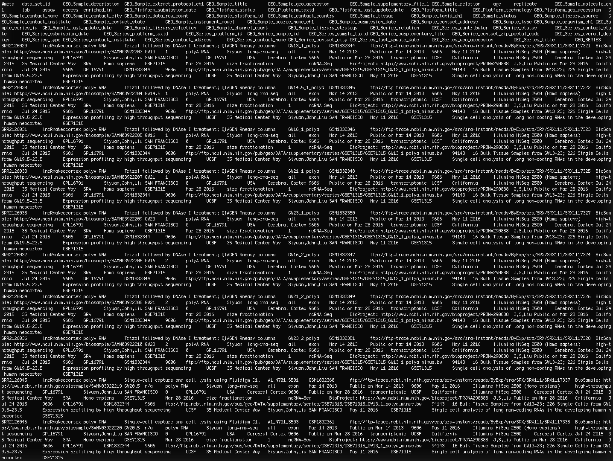

# Color-code columnar data

This is a utility that helps make tab-separated data easier to view on the command line.

This is what it looks like when viewing columnar-data on the command line. It can be difficult to ascertain what belongs to which column.

By passing through a simple grep loop, we can colorize our column output.

