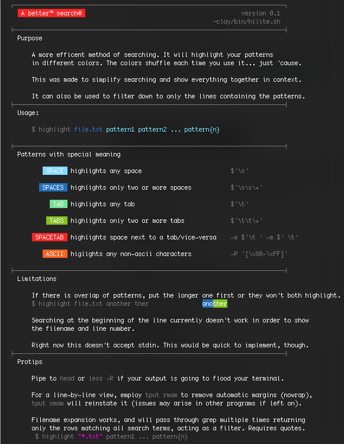
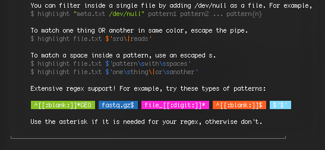
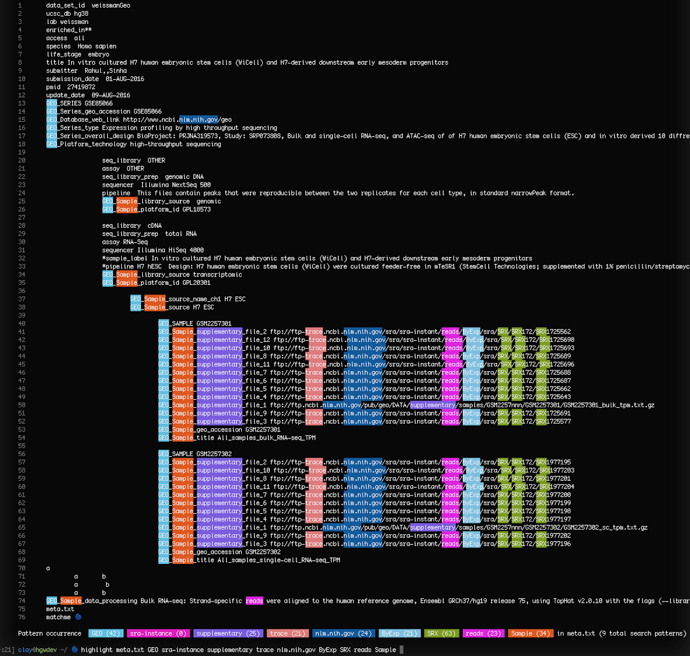

# Highlight patterns

## Description and Usage




## Example



## How it works

Most of the work happens with a simple grep loop like this:

```bash

FILENUM=$(for f in $1; do echo "${f}"; done | wc -l | cut -f 1 -d " ")
OFFSET=$((1+FILENUM))
SEARCHTERMS=$(for f in $@; do echo "${f}"; done | tail -n +$OFFSET)
COMMAND="grep -n '' $FILE"
i=0
TERMS=0
OCCURRENCES=""
SEARCH="printf \"\n     Pattern occurrence "

for f in $SEARCHTERMS; do
	OCCURRENCES="\$(cat $FILE | grep -o -e '$f' | wc -l)"
	COMMAND=" $COMMAND | LC_CTYPE=C GREP_COLOR='00;48;5;$color' grep --color=always -e '$f' $RETURNALL "
        CLEANLINE=
        if [ "$FILENUM" -gt "1" ]; then
                CLEANLINE=$(for f in $1; do echo "${f}"; done | while read line; do printf "$CLEANLINE"; if [ "$line" == "/dev/null" ]; then line="\/dev\/null"; fi; printf " | sed 's/^\\($line\\):\\([[:digit:]]*\\):/\t\\e[38;5;240m\\\1\t\\\2\t\\033[0m/g'"; done)
        else
                CLEANLINE=$(printf " | sed 's/^\\([[:digit:]]*\\):/\\t\\e[38;5;240m\\\1\t\\033[0m/g'")
        fi
eval "$COMMAND $CLEANLINE"
SEARCH="$SEARCH in $FILES ($TERMS total search patterns)\n\n\""
eval "$SEARCH"
```
